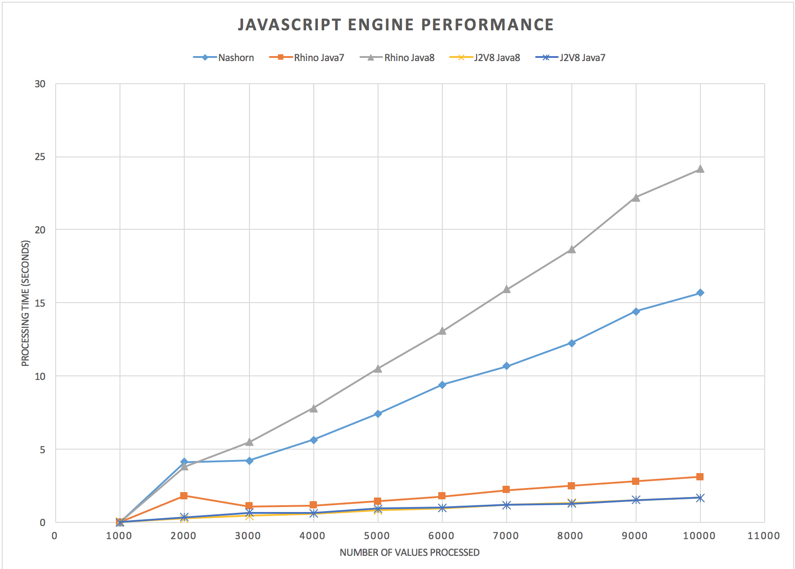

# JavaScript Performance on Java

With the long-awaited release of Java 8 came excitement about a new JavaScript engine called Nashorn that promised much-improved performance. Taking advantage of new invokedynamic instructions introduced to the JVM in Java 7, the JavaScript is compiled to bytecode and optimized by the JIT compiler. That means the more times you run the same script, the faster it gets.

Perfect! I work on an application that executes simple JavaScript snippets across millions of database records as they are transferred between systems. I fired up our application in Java 8 and... it was much slower. With no time to investigate the underlying cause, we put it on the back burner and stayed with Java 7.

Recently, I heard about J2V8 which allows running JavaScript with the famous V8 engine within Java. V8 is known for performance, so I decided to give it a shot. I through together a quick proof of concept, and sure enough, it blew away the competition. (Note that J2V8 is not yet included in this sample project).

At EclipseCon, I met an Oracle Java product manager, who was not convinced that Nashorn could be so slow. Since we had a reproducible test, it was easy to hookup Java Flight Recorder and Mission Control to do some profiling. The results showed that Nashorn was creating new lamda functions and compiling them on every iteration. I tried various things, but couldn't figure out what the problem was. We were using a CompiledScript, keeping it around, and executing it for each iteration.

On the way home, I decided to take another look. With fresh eyes, I saw that we were creating a new SimpleBindings for each execution. This seems like the right thing to do, since the bindings holds arguments for each execution, and the CompiledScript.eval call accepts the bindings as a parameter. Since I had tried everything else, I decided to try reusing the Bindings. Lo and behold, that was the answer. Moving the creation of the bindings outside of the loop fixed the peformance. Now with JIT able to do its thing, Nashorn is even faster than J2V8.

For comparison, here is a chart showing just Nashorn with the old code that created new bindings versus the new code that reuses the bindings.

#tl;dr;
If you’re using Nashorn to run JavaScript on Java 8, be careful how you manage your Bindings.
